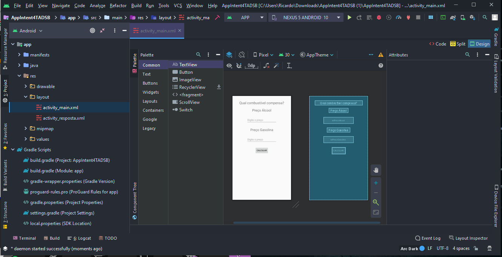
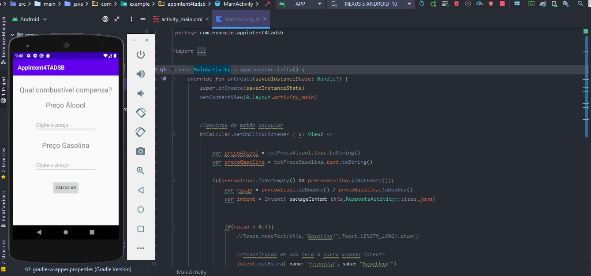

# AppAndroid_CompPreco
 
<h1>Aplicatico Android - Comparador de Preços </h1>
 
<h1>Indrodução:</h1>
<h3>O aplicatico em questão tem omo foco promover a flexiblidade aos motoristas em saber qual opção seria mais econômica: Alcool x Gasolina em determinados postos de gasolina< /h3>
 
<h2>Screenshots:</h2>
<h5>Initial:</h5>
  

<h5>Emulation app</h5>

  
  
 
<h1>Stacks:</h1>
-> Kotlin
 
